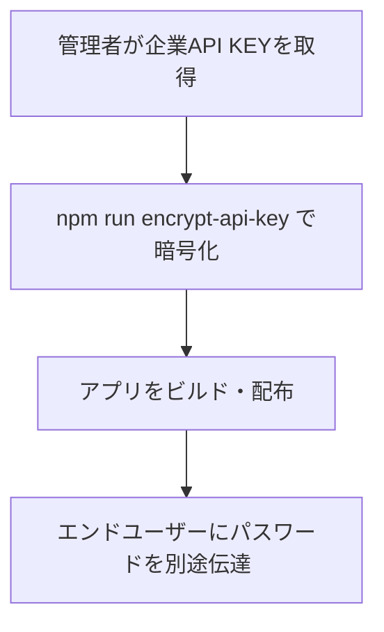
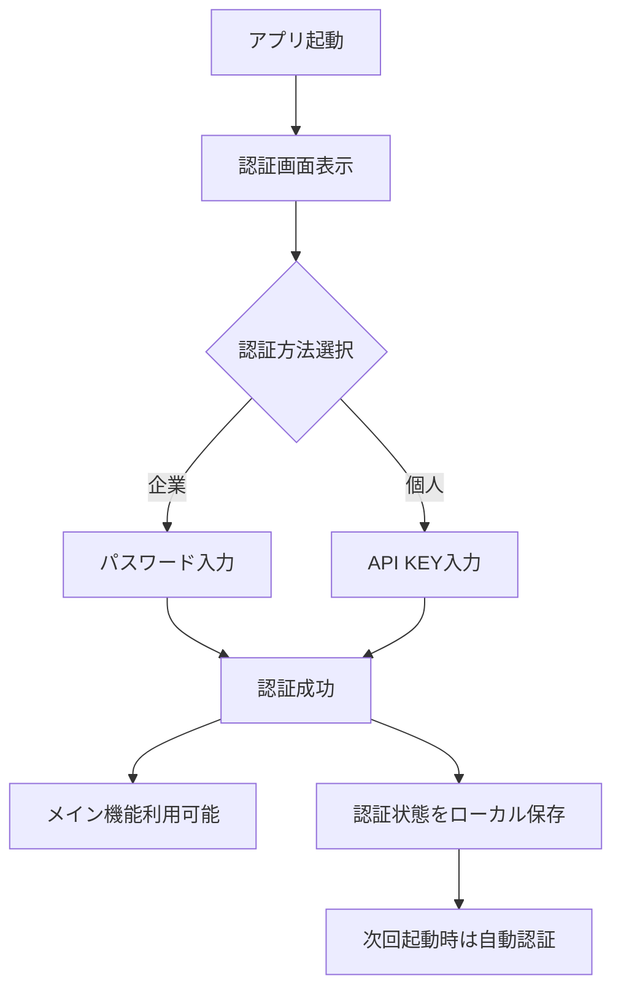

# API KEYの埋め込みと暗号化システム

## 概要

本システムは**ハイブリッド認証方式**を採用し、企業配布と個人利用の両方に対応したセキュアなAPI KEY管理システムです。

## システム構成

### 1. 認証方式

#### 1.1 企業パスワード認証
- 暗号化されたAPI KEYをアプリケーションに埋め込み
- パスワード入力により復号してAPI KEYを取得
- 企業での一括配布に最適

#### 1.2 個人API KEY認証
- ユーザーが自分のAPI KEYを入力
- 暗号化してローカルストレージに保存
- 個人利用に最適

### 2. 核となるコンポーネント

#### 2.1 認証サービス (`src/services/authService.ts`)
- **役割**: 認証状態の管理、API KEYの暗号化・復号
- **ライブラリ**: `crypto-js` (AES暗号化)
- **パターン**: シングルトンパターン

#### 2.2 暗号化スクリプト (`scripts/encrypt-api-key.js`)
- **役割**: ビルド時のAPI KEY暗号化
- **実行**: `npm run encrypt-api-key`

#### 2.3 認証UI (`src/components/AuthSetup.tsx`)
- **役割**: 認証方法選択画面
- **機能**: 企業パスワード入力 or 個人API KEY入力

## 企業パスワード認証の詳細

### 1. ビルド時の暗号化処理

```bash
# 環境変数でAPI KEYとパスワードを設定
CORPORATE_API_KEY=sk-xxx... CORPORATE_PASSWORD=MyPassword npm run encrypt-api-key
```

#### 暗号化スクリプトの処理フロー

1. 環境変数から`CORPORATE_API_KEY`と`CORPORATE_PASSWORD`を取得
2. `CryptoJS.AES.encrypt()`でAPI KEYを暗号化
3. `src/services/authService.ts`の`ENCRYPTED_CORPORATE_API_KEY`定数を更新
4. `CORPORATE_PASSWORD`定数も更新

### 2. 実行時の復号処理

```typescript
// authService.ts内の復号メソッド
private decryptCorporateApiKey(password: string): string | null {
  try {
    const bytes = CryptoJS.AES.decrypt(ENCRYPTED_CORPORATE_API_KEY, password);
    const decrypted = bytes.toString(CryptoJS.enc.Utf8);
    
    if (decrypted && decrypted.startsWith('sk-')) {
      return decrypted;
    }
    return null;
  } catch (error) {
    console.error('API KEYの復号に失敗:', error);
    return null;
  }
}
```

## 個人API KEY認証の詳細

### 1. 暗号化して保存

```typescript
// 個人API KEYの暗号化保存
const encryptedPersonalKey = CryptoJS.AES.encrypt(apiKey, 'personal_key_salt').toString();
localStorage.setItem('minutesgen_personal_api_key', encryptedPersonalKey);
```

### 2. 復号して取得

```typescript
// 個人API KEYの復号取得
private decryptPersonalApiKey(): string | null {
  try {
    const encryptedKey = localStorage.getItem('minutesgen_personal_api_key');
    if (!encryptedKey) return null;

    const bytes = CryptoJS.AES.decrypt(encryptedKey, 'personal_key_salt');
    const decrypted = bytes.toString(CryptoJS.enc.Utf8);
    
    if (decrypted && decrypted.startsWith('sk-')) {
      return decrypted;
    }
    return null;
  } catch (error) {
    console.error('個人API KEYの復号に失敗:', error);
    return null;
  }
}
```

## 認証状態の管理

### 1. 認証状態の構造

```typescript
interface AuthState {
  isAuthenticated: boolean;
  authMethod: 'corporate' | 'personal' | null;
  apiKey: string | null;
}
```

### 2. ローカルストレージでの状態保存

```typescript
// セキュリティ重視：API KEYは保存せず、認証状態のみ保存
private saveAuthState(): void {
  const stateToSave = {
    isAuthenticated: this.authState.isAuthenticated,
    authMethod: this.authState.authMethod,
    // API KEYは保存しない（セキュリティ）
  };
  localStorage.setItem('minutesgen_auth_state', JSON.stringify(stateToSave));
}
```

## セキュリティ対策

### 1. メモリ上でのAPI KEY管理
- API KEYは必要時に復号して一時的にメモリに保持
- 認証状態のみローカルストレージに保存
- API KEY自体はローカルストレージに平文保存しない

### 2. 暗号化の仕組み
- **企業KEY**: 固定パスワードでAES暗号化
- **個人KEY**: 固定ソルト（'personal_key_salt'）でAES暗号化
- `CryptoJS.AES.encrypt/decrypt`使用

## 実装要件

### 1. 必須パッケージ

```json
{
  "dependencies": {
    "crypto-js": "^4.2.0"
  },
  "devDependencies": {
    "@types/crypto-js": "^4.2.2"
  }
}
```

### 2. package.jsonスクリプト

```json
{
  "scripts": {
    "encrypt-api-key": "node scripts/encrypt-api-key.js"
  }
}
```

## 他アプリへの移植時の注意点

### 1. カスタマイズが必要な箇所

| 項目 | 現在の値 | 変更内容 |
|------|----------|----------|
| ローカルストレージキー名 | `minutesgen_*` | アプリ固有の名前 |
| 暗号化ソルト | `personal_key_salt` | アプリ固有の値 |
| 認証状態の構造 | `AuthState` | アプリの要件に応じて調整 |
| UI表示テキスト | 議事録アプリ向け | アプリに合わせた文言 |

### 2. セキュリティ強化案

#### 2.1 動的パスワード生成
- 固定パスワードではなく、環境やビルド時に動的生成
- より強固なセキュリティを実現

#### 2.2 追加暗号化レイヤー
- PBKDF2やscryptなどの鍵導出関数使用
- より堅牢な暗号化方式の採用

#### 2.3 有効期限設定
- 暗号化されたAPI KEYに有効期限を設定
- 定期的な更新を強制

#### 2.4 ハードウェアセキュリティ
- TPMやセキュアエンクレーブの活用
- ハードウェアレベルでの保護

## 運用フロー

### 1. 企業配布時



### 2. エンドユーザー使用時



## ファイル構成

```
src/
├── services/
│   └── authService.ts          # 認証サービス（メインロジック）
├── components/
│   ├── AuthSetup.tsx           # 認証UI
│   └── APISettings.tsx         # API設定画面
├── config/
│   └── api.ts                  # API設定管理
└── hooks/
    └── useAppState.ts          # アプリ状態管理

scripts/
└── encrypt-api-key.js          # 暗号化スクリプト

package.json                    # npm scripts設定
```

## 主要メソッド一覧

### AuthService クラス

| メソッド | 説明 |
|----------|------|
| `getInstance()` | シングルトンインスタンス取得 |
| `authenticateWithPassword()` | 企業パスワード認証 |
| `authenticateWithPersonalKey()` | 個人API KEY認証 |
| `getApiKey()` | 現在のAPI KEY取得 |
| `isAuthenticated()` | 認証状態確認 |
| `decryptCorporateApiKey()` | 企業API KEY復号（private） |
| `decryptPersonalApiKey()` | 個人API KEY復号（private） |
| `saveAuthState()` | 認証状態保存（private） |
| `loadAuthState()` | 認証状態読み込み（private） |

## 設定例

### 企業配布用設定

```bash
# .env.corporate
CORPORATE_API_KEY=sk-proj-abc123...
CORPORATE_PASSWORD=CompanySecurePassword2024
```

### 個人利用用設定

```typescript
// ユーザーがUI経由で入力
const personalApiKey = "sk-proj-def456...";
// 自動的に暗号化されてローカルストレージに保存
```

## まとめ

このシステムにより、以下のメリットが実現されます：

1. **企業配布**: 一括配布時のAPI KEY管理が簡単
2. **個人利用**: 柔軟なAPI KEY設定が可能
3. **セキュリティ**: 暗号化によるAPI KEYの保護
4. **利便性**: 認証状態の永続化により再入力不要
5. **拡張性**: 他アプリへの移植が容易

企業での統一管理と個人での自由度を両立させた、実用的なAPI KEY管理システムです。 