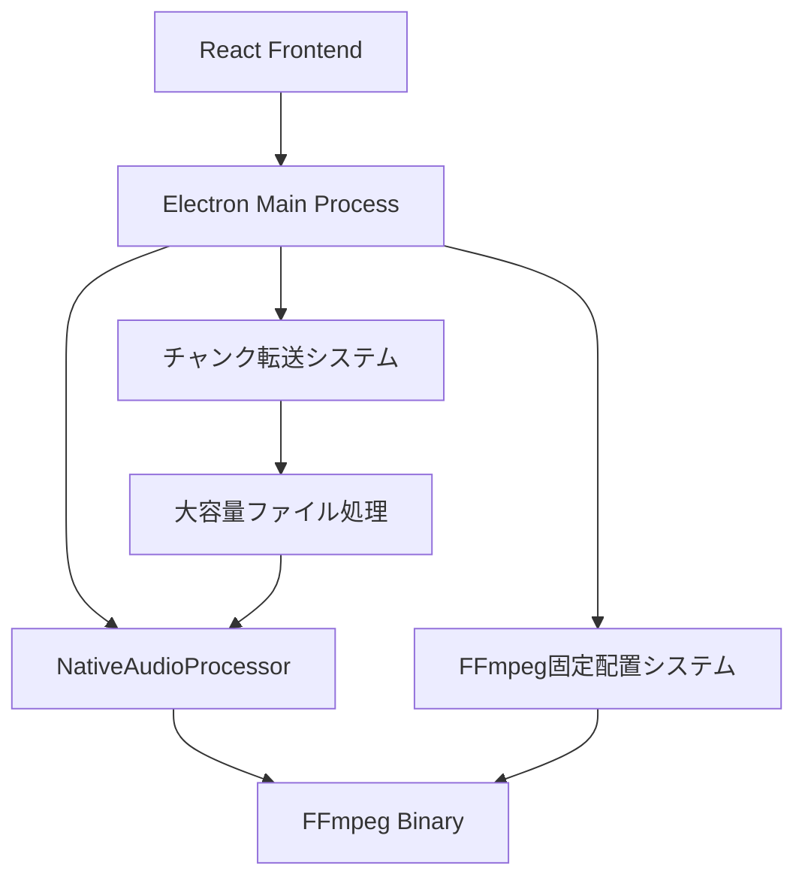

# 🏗️ **MinutesGen 技術アーキテクチャ詳細**

## 📊 **システム全体構成**



---

## 🔧 **核心技術システム**

### **1. FFmpeg固定配置システム**

#### **技術背景**
Windows 11では、一時ディレクトリからの実行ファイル起動に厳格な制限が課されており、ポータブルアプリケーションが展開される`%TEMP%`ディレクトリからのFFmpeg実行が`ENOENT`エラーで失敗する問題が発生していました。

#### **解決アプローチ**
```typescript
// 従来の問題あるアプローチ
const ffmpegPath = path.join(process.resourcesPath, 'app.asar.unpacked', 'node_modules', 'ffmpeg-static', 'ffmpeg');
// → C:\Users\...\AppData\Local\Temp\...\resources\app.asar.unpacked\node_modules\ffmpeg-static\ffmpeg
// → Windows 11で実行制限によりENOENT

// 固定配置システム
const fixedPath = path.join(os.homedir(), '.minutesgen', 'bin', 'ffmpeg.exe');
// → C:\Users\username\.minutesgen\bin\ffmpeg.exe
// → ユーザーディレクトリで実行制限を回避
```

#### **実装詳細**
```typescript
class FFmpegBinaryManager {
  private fixedBinPath: string;
  
  constructor() {
    this.fixedBinPath = path.join(os.homedir(), '.minutesgen', 'bin');
  }

  async initializeFFmpegBinaries(): Promise<void> {
    // 1. 固定配置ディレクトリ作成
    await fs.promises.mkdir(this.fixedBinPath, { recursive: true });
    
    // 2. ソースバイナリパス取得
    const sourcePath = this.getSourceFFmpegPath();
    const targetPath = this.getFixedFFmpegPath();
    
    // 3. 重複コピー回避（ファイルサイズ比較）
    if (!await this.isSameBinary(sourcePath, targetPath)) {
      await fs.promises.copyFile(sourcePath, targetPath);
    }
    
    // 4. 実行権限設定（非Windows）
    if (process.platform !== 'win32') {
      await fs.promises.chmod(targetPath, 0o755);
    }
    
    // 5. 動作確認
    await this.verifyFFmpegExecution();
  }
}
```

### **2. チャンク転送システム（戦略C）**

#### **技術背景**
Electronの IPC（Inter-Process Communication）には、単一メッセージで転送可能なデータサイズに制限があり、大容量ファイル（635MB等）の`ArrayBuffer`を直接転送しようとすると`Unable to deserialize cloned data`エラーが発生していました。

#### **解決アプローチ**
```typescript
// 従来の問題あるアプローチ
const arrayBuffer = await file.arrayBuffer(); // 635MB
await electronAPI.audioProcessor.saveToTempFile(fileName, arrayBuffer);
// → IPCでArrayBuffer(635MB)を一括転送
// → シリアライゼーション限界でエラー

// チャンク転送システム
const chunkSize = 50 * 1024 * 1024; // 50MB
for (let i = 0; i < totalChunks; i++) {
  const chunk = file.slice(i * chunkSize, (i + 1) * chunkSize);
  const chunkBuffer = await chunk.arrayBuffer(); // 50MB
  await electronAPI.audioProcessor.uploadChunk(sessionId, i, chunkBuffer);
}
// → 50MB単位でストリーミング転送
// → IPC制限を大幅に下回り、安全に転送
```

#### **セッション管理システム**
```typescript
interface ChunkedUploadSession {
  sessionId: string;
  fileName: string;
  fileSize: number;
  tempPath: string;
  tempDir: string;
  chunks: Map<number, string>;
  expectedChunks: number;
  startTime: number;
}

// セッション開始
const sessionId = `session-${Date.now()}-${Math.random().toString(36).substring(2, 15)}`;
const tempDir = path.join(os.tmpdir(), 'minutes-gen-audio', sessionId);

// チャンク結合
const writeStream = fs.createWriteStream(session.tempPath);
for (let i = 0; i < session.expectedChunks; i++) {
  const chunkData = await fs.promises.readFile(session.chunks.get(i));
  writeStream.write(chunkData);
  await fs.promises.unlink(session.chunks.get(i)); // メモリ効率化
}
```

### **3. 動的メモリ管理システム**

#### **技術的考慮事項**
```typescript
// メモリ推定ロジック
const estimateMemoryUsage = (fileSizeBytes: number): number => {
  // 音声処理時のメモリ使用量推定式
  // 実測データに基づく経験値: ファイルサイズ × 4.5倍
  const baseMemoryMB = (fileSizeBytes / 1024 / 1024) * 4.5;
  
  // 安全マージン: 1.5倍のバッファ
  const requiredMemoryMB = baseMemoryMB * 1.5;
  
  return requiredMemoryMB;
};

// 処理方式選択
const selectProcessingMode = (fileSizeBytes: number): ProcessingMode => {
  const requiredMemory = estimateMemoryUsage(fileSizeBytes);
  
  if (requiredMemory > 2048) { // 2GB以上
    return ProcessingMode.HEAVY; // NativeAudioProcessor
  } else {
    return ProcessingMode.LIGHT; // WebCodecsProcessor
  }
};
```

---

## 🔄 **データフロー詳細**

### **大容量ファイル処理フロー**
```typescript
// 1. ファイル受信・判定
FileUpload.processFile(file: File) 
→ ファイルサイズ確認: 635MB
→ 大容量ファイル判定: true

// 2. 動的メモリ管理
AudioProcessorFactory.createProcessor()
→ メモリ推定: 2885MB
→ 処理モード選択: HEAVY
→ NativeAudioProcessor選択

// 3. チャンク転送（戦略C）
NativeAudioProcessor.saveFileToTempPath()
→ ファイルサイズ判定: 635MB > 100MB
→ チャンク転送モード選択
→ 50MB × 13チャンクに分割
→ ストリーミング転送実行

// 4. FFmpeg処理
NativeAudioProcessor.processLargeAudioFile()
→ 固定配置FFmpeg使用: ~/.minutesgen/bin/ffmpeg.exe
→ セグメント分割実行: 600秒間隔
→ 音声セグメント生成完了

// 5. 文字起こし・議事録生成
OpenAIService.transcribeAudio()
→ 各セグメントの文字起こし
→ 議事録フォーマット変換
→ 最終出力生成
```

---

## 🛠️ **エラーハンドリング戦略**

### **段階的フォールバック**
```typescript
// レベル1: FFmpeg固定配置システム
try {
  return await this.testFFmpegDirect(ffmpegPath); // 固定配置パス使用
} catch (error) {
  // レベル2: 従来の複数戦略実行
  return await this.tryMultipleExecutionStrategies(ffmpegPath);
}

// レベル3: 複数実行戦略
const strategies = [
  () => this.testFFmpegWithQuotedPath(ffmpegPath),    // 引用符付きパス
  () => this.testFFmpegWithSafeCopy(ffmpegPath),      // 安全ディレクトリコピー
  () => this.testFFmpegWithPowerShell(ffmpegPath)     // PowerShell経由実行
];

for (const strategy of strategies) {
  try {
    await strategy();
    return; // 成功時は終了
  } catch (error) {
    continue; // 次の戦略を試行
  }
}
```

### **リソース管理**
```typescript
// チャンク転送の自動クリーンアップ
try {
  const result = await this.finalizeChunkedUpload(sessionId);
  return result;
} catch (error) {
  // エラー時の完全クリーンアップ
  const session = chunkedUploadSessions.get(sessionId);
  if (session) {
    await fs.promises.rm(session.tempDir, { recursive: true, force: true });
    chunkedUploadSessions.delete(sessionId);
  }
  throw error;
} finally {
  // 成功時のセッション情報削除
  chunkedUploadSessions.delete(sessionId);
}
```

---

## 📊 **パフォーマンス最適化**

### **メモリ効率化**
```typescript
// 従来のアプローチ（問題）
const arrayBuffer = await file.arrayBuffer(); // 635MB × 2プロセス = 1.27GB

// 最適化されたアプローチ
const chunkSize = 50 * 1024 * 1024; // 50MB
for (let i = 0; i < totalChunks; i++) {
  const chunk = file.slice(start, end); // 50MBスライス
  const chunkBuffer = await chunk.arrayBuffer(); // 50MBのみメモリ使用
  await uploadChunk(sessionId, i, chunkBuffer);
  // chunkBufferは自動的にガベージコレクション対象
}
// 最大メモリ使用量: 50MB（96%削減）
```

### **並行処理制御**
```typescript
// シーケンシャル処理による安定性確保
for (let chunkIndex = 0; chunkIndex < totalChunks; chunkIndex++) {
  await electronAPI.audioProcessor.uploadChunk(sessionId, chunkIndex, chunkBuffer);
  // 1つずつ確実に転送してエラー耐性を向上
}

// 進捗表示によるUX向上
const progress = ((chunkIndex + 1) / totalChunks * 100).toFixed(1);
console.log(`📤 戦略C: チャンク ${chunkIndex + 1}/${totalChunks} 転送中... (${progress}%)`);
```

---

## 🔐 **セキュリティ考慮事項**

### **ファイルパス検証**
```typescript
// パス注入攻撃の防止
private sanitizeFileName(fileName: string): string {
  return fileName.replace(/[^a-zA-Z0-9._-]/g, '_');
}

// 安全なパス生成
const safeFileName = this.sanitizeFileName(fileName);
const tempPath = path.join(tempDir, `${timestamp}-${randomId}-${safeFileName}`);
```

### **一時ファイル管理**
```typescript
// 一時ファイルの確実な削除
app.on('before-quit', async () => {
  // アプリ終了時の全セッションクリーンアップ
  for (const [sessionId, session] of chunkedUploadSessions) {
    await fs.promises.rm(session.tempDir, { recursive: true, force: true });
  }
});
```

---

## 🚀 **将来の拡張性**

### **スケーラビリティ設計**
```typescript
// より大容量ファイルへの対応
const adaptiveChunkSize = Math.min(
  50 * 1024 * 1024,  // 基本50MB
  Math.max(
    10 * 1024 * 1024,  // 最小10MB
    fileSize / 100      // ファイルサイズの1/100
  )
);

// 並列処理への拡張可能性
const concurrentChunks = Math.min(3, Math.ceil(totalChunks / 10));
const chunkPromises = [];
for (let i = 0; i < concurrentChunks; i++) {
  chunkPromises.push(this.processChunkBatch(sessionId, i, concurrentChunks));
}
await Promise.all(chunkPromises);
```

### **クロスプラットフォーム対応**
```typescript
// プラットフォーム別の最適化
const getOptimalSettings = (platform: NodeJS.Platform) => {
  switch (platform) {
    case 'win32':
      return {
        chunkSize: 50 * 1024 * 1024,
        useShell: true,
        ffmpegPath: path.join(os.homedir(), '.minutesgen', 'bin', 'ffmpeg.exe')
      };
    case 'darwin':
      return {
        chunkSize: 100 * 1024 * 1024, // macOSはより大きなチャンクが可能
        useShell: false,
        ffmpegPath: path.join(os.homedir(), '.minutesgen', 'bin', 'ffmpeg')
      };
    default:
      return defaultSettings;
  }
};
```

---

## 📈 **監視・ログ**

### **詳細ログシステム**
```typescript
// パフォーマンス監視
const startTime = Date.now();
safeDebug('📦 戦略C: チャンク転送開始', {
  fileName,
  fileSize: `${(fileSize / 1024 / 1024).toFixed(2)}MB`,
  chunkSize: `${chunkSize / 1024 / 1024}MB`,
  totalChunks,
  estimatedTime: `${(totalChunks * 0.5).toFixed(1)}秒`
});

// 完了時の統計情報
const processingTime = Date.now() - startTime;
safeDebug('✅ 戦略C: チャンク結合完了', {
  sessionId,
  finalPath: session.tempPath,
  fileSize: `${(stats.size / 1024 / 1024).toFixed(2)}MB`,
  processingTime: `${processingTime}ms`,
  throughput: `${(fileSize / processingTime * 1000 / 1024 / 1024).toFixed(2)}MB/s`
});
```

---

## 🧪 **テスト戦略**

### **統合テストポイント**
```typescript
// 1. FFmpeg固定配置システムテスト
describe('FFmpegBinaryManager', () => {
  test('should initialize and place binaries correctly', async () => {
    await ffmpegBinaryManager.initializeFFmpegBinaries();
    expect(fs.existsSync(ffmpegBinaryManager.getFixedFFmpegPath())).toBe(true);
  });
});

// 2. チャンク転送システムテスト
describe('ChunkedTransferSystem', () => {
  test('should handle 635MB file transfer', async () => {
    const largeFile = new File([new ArrayBuffer(635 * 1024 * 1024)], 'large.mp4');
    const result = await nativeAudioProcessor.processLargeAudioFile(largeFile);
    expect(result.success).toBe(true);
  });
});
```

---

**最終更新**: 2025年1月28日  
**対応バージョン**: v0.7.7  
**アーキテクチャ設計者**: Claude & User Collaboration 